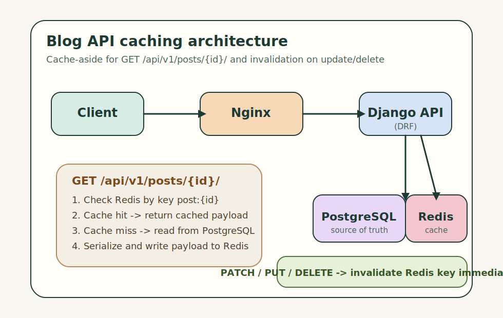

# Blog API с кешированием

## 1. Описание проекта
Blog API с кешированием - это Django-приложение для работы с постами блога.
Проект реализует API из тестового задания: хранит данные в PostgreSQL,
использует Redis для кеширования детального чтения постов и документирует API
через Swagger UI и ReDoc.

Ключевая задача проекта - показать реализацию паттерна `cache-aside`: при
`GET /api/v1/posts/{id}/` приложение сначала пытается получить данные из Redis,
а при cache miss читает запись из PostgreSQL, сериализует её и сохраняет в
кеш. При изменении или удалении поста связанный ключ в Redis инвалидируется.

## 2. Основной функционал
- CRUD для постов через REST API
- Кеширование детального эндпоинта `GET /api/v1/posts/{id}/`
- Инвалидация кеша при `PATCH`, `PUT` и `DELETE`
- Интеграционные тесты кеширования на `pytest`
- Swagger UI и ReDoc документация
- Загрузка изображений для постов через `multipart/form-data`
- Healthcheck для базы данных, кеша, Redis и storage

## 3. Технологии
- Python 3.12+
- Django 6.0.3
- Django REST Framework 3.17.0
- PostgreSQL 18
- Redis 8
- Pytest + pytest-django
- Model Bakery
- Poetry
- Docker Compose
- Gunicorn
- Nginx

## 4. Установка
### 4.1. Клонирование репозитория
```bash
git clone <repo_url>
cd Blog-api-with-caching
```

### 4.2. Настройка окружения
Создай файл `.env` на основе шаблона:

```bash
cp .env.template .env
```

Для продакшен-окружения создай отдельный файл `.env.prod` по аналогии с
`.env.template` и укажи в нем значения для продакшена.

### 4.3. Запуск локальной версии в Docker
Локальная версия поднимается одной командой:

```bash
docker compose up --build
```

После запуска приложение будет доступно на `http://127.0.0.1:8000/`.
Контейнер `api` сам выполняет `check`, `makemigrations`, `migrate` и запускает
dev-сервер.

### 4.4. Запуск продакшен-версии в Docker
Продакшен-версия поднимается через отдельный compose-файл:

```bash
docker compose -f docker-compose.prod.yml up --build
```

В продакшен-режиме контейнер `api` выполняет `check`, `collectstatic`,
`migrate` и запускает `gunicorn`.

### 4.5. Миграции
Миграции применяются автоматически при старте контейнера `api`, но при
необходимости команду можно выполнить вручную:

```bash
docker compose exec api python manage.py migrate
```

Для продакшена:

```bash
docker compose -f docker-compose.prod.yml exec api python manage.py migrate
```

### 4.6. Создание суперпользователя
Даёт доступ к админке:

```bash
docker compose exec api python manage.py createsuperuser
```

Для продакшена:

```bash
docker compose -f docker-compose.prod.yml exec api python manage.py createsuperuser
```

## 5. Использование
- Основной API доступен по адресу `http://127.0.0.1:8000/api/v1/`
- Админка доступна по адресу `http://127.0.0.1:8000/admin/`
- Для создания или обновления поста с картинкой в Swagger нужно выбрать
  `multipart/form-data`
- Отдельная команда загрузки тестовых данных не требуется: для тестов
  используются fixtures и `model_bakery`
- Для запуска тестов не нужен заранее созданный пользователь: тестовые записи
  пользователей и постов создаются автоматически внутри тестовой базы данных
- Для локальной работы рекомендуется держать приложение запущенным через
  `docker compose up --build`

### 5.1. Примеры запросов
Создание поста без изображения:

```bash
curl -X POST http://127.0.0.1:8000/api/v1/posts/ \
  -H "Content-Type: application/json" \
  -d '{
    "title": "Первый пост",
    "text": "Короткий текст публикации",
    "author": 1
  }'
```

Получение поста по ID:

```bash
curl http://127.0.0.1:8000/api/v1/posts/1/
```

Частичное обновление поста:

```bash
curl -X PATCH http://127.0.0.1:8000/api/v1/posts/1/ \
  -H "Content-Type: application/json" \
  -d '{
    "text": "Обновленный текст публикации"
  }'
```

Создание поста с изображением:

```bash
curl -X POST http://127.0.0.1:8000/api/v1/posts/ \
  -F "title=Пост с изображением" \
  -F "text=Текст публикации с картинкой" \
  -F "author=1" \
  -F "image=@/absolute/path/to/image.png"
```

Удаление поста:

```bash
curl -X DELETE http://127.0.0.1:8000/api/v1/posts/1/
```

## 6. Утилиты
Ключевые команды из `Makefile`:

- `make install` - установка зависимостей приложения и dev-инструментов
- `make install-prod` - установка только основных зависимостей
- `make check` - запуск `manage.py check`
- `make test` - запуск тестов через `pytest`
- `make lint` - запуск `ruff`
- `make format` - запуск `black`
- `make schema` - валидация и экспорт схемы OpenAPI
- `make docker-dev-up` - поднять dev-стек
- `make docker-prod-up` - поднять prod-стек
- `make pre-commit-install` - установить git hooks

## 7. Структура данных
### 7.1. Post
- `title` - обязательный заголовок поста, строка до `256` символов
- `text` - обязательное основное содержимое поста
- `author` - обязательный `ForeignKey` на пользователя `identity.User`, при
  удалении пользователя связанные посты удаляются через `CASCADE`
- `image` - необязательное изображение поста
- `created_at` - дата и время создания, выставляется автоматически
- `updated_at` - дата и время последнего обновления, обновляется автоматически
- `post_created_at_idx` - индекс по полю `created_at` для ускорения выборок по
  дате публикации

### 7.2. User
- используется кастомная модель пользователя `identity.User`
- модель наследует стандартные поля `AbstractUser`
- содержит дополнительное поле `patronymic`

## 8. Особенности
- Для кеширования выбран паттерн `cache-aside`
- Redis хранит сериализованное представление поста по ключу вида `post:{id}`
- Часто запрашиваемые посты естественным образом остаются в кеше дольше за
  счёт регулярного чтения по `GET /posts/{id}`
- При изменении или удалении поста кеш инвалидируется сразу
- В проекте настроены Swagger UI, ReDoc и эндпоинт схемы OpenAPI
- В `deploy/nginx.template.conf` лежит продакшен-шаблон для обратного прокси

### 8.1. Почему выбран cache-aside
Паттерн `cache-aside` хорошо подходит для этого задания, потому что источник
истины остается в PostgreSQL, а Redis используется только как быстрый слой
чтения. Такой подход легко реализовать, он прозрачен в отладке, не требует
фоновых воркеров и позволяет точно инвалидировать кеш при обновлении или
удалении поста.

В формулировке задания используется фраза "кеширование популярных постов", но
в технических требованиях явно описан сценарий `GET /posts/{id}` с Redis и
инвалидацией при изменении. Поэтому популярность в проекте интерпретируется
через фактическую частоту чтения detail-эндпоинта: чем чаще пост запрашивают,
тем чаще он повторно используется из кеша.

## 9. Разработка
### 9.1. Зависимости
- основные зависимости находятся в `[project.dependencies]`
- зависимости разработки находятся в `[tool.poetry.group.dev.dependencies]`

### 9.2. Структура проекта
- `core/` - настройки Django, роутинг, WSGI
- `posts/` - модель поста, API, кеширование, тесты
- `identity/` - кастомная модель пользователя
- `deploy/` - инфраструктурные шаблоны, включая `nginx`
- `docs/` - схема архитектуры и сопроводительная документация

### 9.3. Логирование
- используется `django-structlog`
- в приложении настроено структурированное логирование

## 10. Заполнение .env
Основные переменные окружения:

- `DJANGO_SECRET_KEY` - секретный ключ Django
- `DJANGO_DEBUG` - режим отладки
- `DJANGO_ALLOWED_HOSTS` - список допустимых хостов
- `POSTGRES_DB` - имя базы данных
- `POSTGRES_USER` - пользователь PostgreSQL
- `POSTGRES_PASSWORD` - пароль PostgreSQL
- `POSTGRES_HOST` - хост PostgreSQL
- `POSTGRES_PORT` - порт PostgreSQL
- `REDIS_URL` - URL подключения к Redis
- `POST_CACHE_TIMEOUT` - TTL кеша поста в секундах
- `CORS_ALLOW_ALL_ORIGINS` - разрешить все origin
- `CORS_ALLOWED_ORIGINS` - список разрешённых origin
- `USE_HTTPS` - включение HTTPS-режима

Шаблон переменных лежит в [.env.template](.env.template).

## 11. API
Документация и служебные эндпоинты:

- Swagger UI: `http://127.0.0.1:8000/api/v1/schema/swagger-ui/`
- ReDoc: `http://127.0.0.1:8000/api/v1/schema/redoc/`
- OpenAPI schema: `http://127.0.0.1:8000/api/v1/schema/`
- Healthcheck: `http://127.0.0.1:8000/api/health/`

Основные эндпоинты постов:

- `POST /api/v1/posts/`
- `GET /api/v1/posts/`
- `GET /api/v1/posts/{id}/`
- `PATCH /api/v1/posts/{id}/`
- `PUT /api/v1/posts/{id}/`
- `DELETE /api/v1/posts/{id}/`

## 12. Схема архитектуры
ВНИМАНИЕ: Система спректорована разработчиком, рисунки и описание делал ИИ для ускорения работы
Визуальная схема:



Текстовое описание и пояснения лежат в [docs/architecture.md](docs/architecture.md).


## 13. ВНИМАНИЕ
Система спректорована разработчиком, рисунки и описание(readme) делал ИИ для ускорения работы.